<!-- _class: lead
-->

# Как _количество_ тестов производительности переходит в __качество__


---

# Ночь ...

# ✨ 🌙 💤

---


# Ночь

# вдруг просыпается нагрузочник со словами: __"Отчет не отправил!"__

---
<!-- _class: main -->

## __Автотесты__

---
<!-- _class: main -->

## __Автотесты__ 
## производительности.

---
<!-- _class: main -->

## __Автотесты__ 
## производительности,

# которых _много_.


---
<!-- _class: main -->

## __Автотесты__ 
## производительности,

# которых _много_, 
## и это __хорошо__


---

<!-- _class: about -->

# Смирнов Вячеслав
## Ускоряю _miro.com_
### Развиваю __@qa_load__

---

# План

1) В чем _проблема_ тестирования производительности?

1) Как понять _результат_ теста за секунду?
1) Как понять __сотню__ _результатов_ тестов за минуту?
1) Что дает _TMS_ (__Allure__) читателю?
1) Что дает _Test Framework_ (__JUnit__) писателю?
1) Почему _больше_ тестов — лучше?
1) Какие есть __примеры__?

---


<!-- _class: lead -->

# 1️⃣ В чем _проблема_ тестирования производительности?


---

<!-- _class: main -->

# Просто ли __написать тесты__ производительности?

---


---


---


---


---


---

<!-- _class: main -->


# __Непростые__ 
# тесты


---

<!-- _class: main -->


# Просто ли _понять отчет_ по производительности?

---

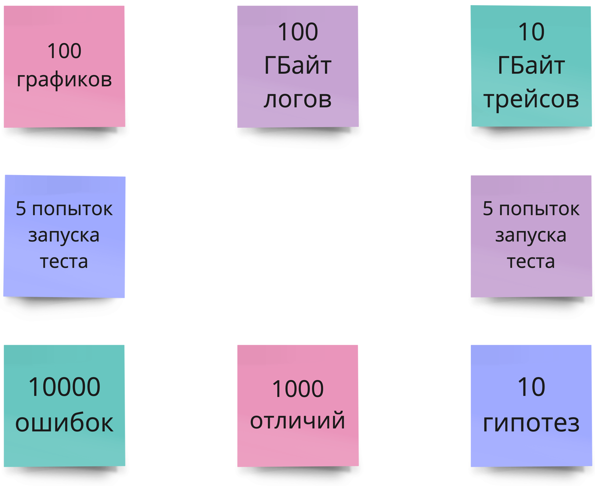


---


---


---


<!-- _class: main -->


# __Непростые__ тесты 
# и
# __непростые__ результаты

---


<!-- _class: main -->


# Непростые тесты
# и
# __непростые__ _результаты_

---


<!-- _class: lead -->


# Людям сложно читать
# __непростые__ _результаты_
# нагрузочных тестов

---


<!-- _class: lead -->

# 2️⃣ Как понять _результат_ теста за секунду?

---

# Простейший результат __теста__: 

# ✅ хорошо
# 🛑 плохо

---

# Простейший результат __теста__:

# ✅ хорошо
# 🛑 плохо
# ⚠️ не получилось проверить

---

# Результат __набора__ тестов:

# ✅ 15
# ✅ 10 🛑 5
# 🛑 15
# ⚠️ 15

---

# Результат __набора__ тестов:

# ✅ 15 — _все хорошо_ 
# ✅ 10 🛑 5
# 🛑 15
# ⚠️ 15

---

# Результат __набора__ тестов:

# ✅ 15
# ✅ 10 🛑 5  — _кое-что сломалось_
# 🛑 15
# ⚠️ 15

---

# Результат __набора__ тестов:

# ✅ 15
# ✅ 10 🛑 5
# 🛑 15   — _все плохо_
# ⚠️ 15

---

# Результат __набора__ тестов:

# ✅ 15
# ✅ 10 🛑 5
# 🛑 15
# ⚠️ 15   — _не удалось проверить_


---

<!-- _class: main -->

# Простейший результат — это __статус__ ✅ 🛑 и __описание__ теста: сервис, версия, метод

---

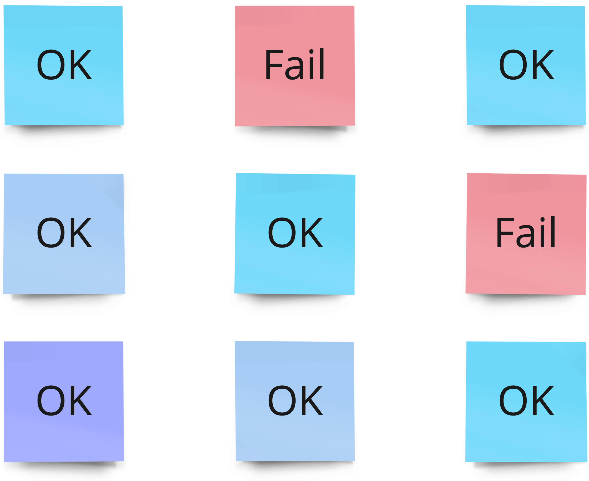

---


---

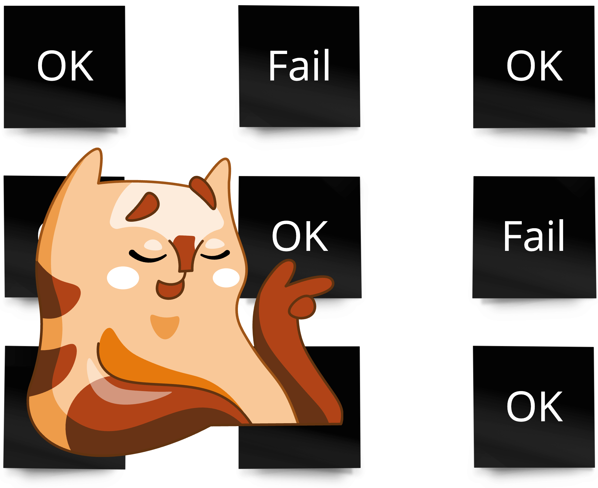

---

<!-- _class: lead -->

# Для быстрого понимания результатов тестов производительности, результат должен стать статусом: _да_ или __нет__

---


<!-- _class: lead -->

# 3️⃣ Как понять __сотню__ _результатов_ тестов за минуту?

---

# Что с API?

| API           | Version 1.2.3 | Version 1.2.4 |
|:--------------|--------------:|--------------:|
| GET /users    |           ✅80 |           ✅80 |
| POST /project |           ✅60 |           ✅60 |
| GET /project  |           ✅60 |       ✅52 🛑8 |
| GET /account  |           ✅50 |           ✅50 |

---

# Сбой __GET /project__ для версии _1.2.4_

| API              | Version 1.2.3 | Version _1.2.4_ |
|:-----------------|--------------:|----------------:|
| GET /users       |           ✅80 |             ✅80 |
| POST /project    |           ✅60 |             ✅60 |
| __GET /project__ |           ✅60 |         ✅52 🛑8 |
| GET /account     |           ✅50 |             ✅50 |


---

# Что не так с __GET /project__?

| API              | Payload             | Version 1.2.3 | Version 1.2.4 |
|:-----------------|:--------------------|--------------:|--------------:|
| __GET /project__ | ?fields=id          |           ✅15 |           ✅15 |
| __GET /project__ | ?fields=name        |           ✅15 |           ✅15 |
| __GET /project__ | ?fields=items       |           ✅15 |        ✅7 🛑8 |
| __GET /project__ | ?fields=permissions |           ✅15 |           ✅15 |


---

# Поле __items__ замедлилось в _1.2.4_

| API          | Payload             | Version 1.2.3 | Version _1.2.4_ |
|:-------------|:--------------------|--------------:|----------------:|
| GET /project | ?fields=id          |           ✅15 |             ✅15 |
| GET /project | ?fields=name        |           ✅15 |             ✅15 |
| GET /project | ?fields=__items__   |           ✅15 |          ✅7 🛑8 |
| GET /project | ?fields=permissions |           ✅15 |             ✅15 |


---


<!-- _class: lead -->

# _Аналитический отчет_ или сводная таблица позволяют __быстро__ найти _что_, _где_ и _когда_ сломалось 

---

<!-- _class: lead -->

# 4️⃣ Что дает _TMS_ (__Allure__) читателю?

---

<!-- _class: main -->

# Подход применим к любой _TMS_: Allure TestOps, TestRail, TestIT, Qase, ... или __самописной__

---


---

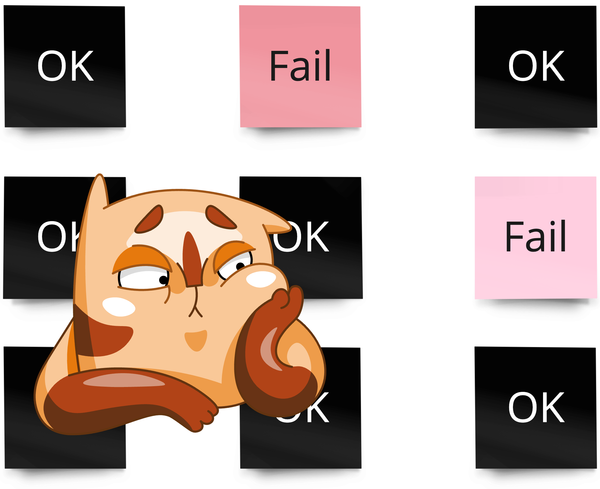

---

# Нужно сделать вот такой отчет

| API          | Payload             | Version 1.2.3 | Version _1.2.4_ |
|:-------------|:--------------------|--------------:|----------------:|
| GET /project | ?fields=id          |           ✅15 |             ✅15 |
| GET /project | ?fields=name        |           ✅15 |             ✅15 |
| GET /project | ?fields=__items__   |           ✅15 |          ✅7 🛑8 |
| GET /project | ?fields=permissions |           ✅15 |             ✅15 |

---

# Где есть _Service_, _API_, _Payload_, _Version_, ...

| API          | Payload             | Version 1.2.3 |   Version 1.2.4 |
|:-------------|:--------------------|--------------:|----------------:|
| GET /project | ?fields=id          |           ✅15 |             ✅15 |
| GET /project | ?fields=name        |           ✅15 |             ✅15 |
| GET /project | ?fields=items       |           ✅15 |          ✅7 🛑8 |
| GET /project | ?fields=permissions |           ✅15 |             ✅15 |

# по __каждому результату__ теста

---

## __[https://allurereport.org/docs/junit5/#organize-tests](https://allurereport.org/docs/junit5/#organize-tests)__

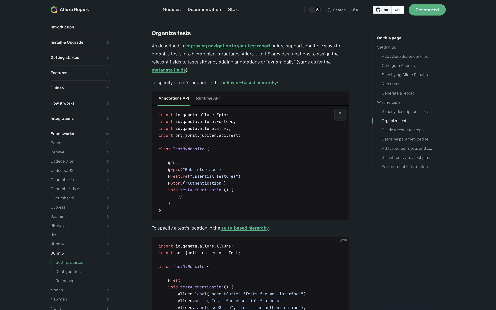

---

## __[https://allurereport.org/docs/junit5/#organize-tests](https://allurereport.org/docs/junit5/#organize-tests)__

# _Behavior_: Epic / Feature / Story


---

## __[https://allurereport.org/docs/junit5/#organize-tests](https://allurereport.org/docs/junit5/#organize-tests)__

# Behavior: Epic / Feature / Story

# _Annotations_ API


---

## __[https://allurereport.org/docs/junit5/#organize-tests](https://allurereport.org/docs/junit5/#organize-tests)__

# Behavior: Epic / Feature / Story

# Annotations API


```groovy
    @Epic("Web interface")
    @Feature("Essential features")
    @Story("Authentication")
```


---


---

## __[https://allurereport.org/docs/junit5/#organize-tests](https://allurereport.org/docs/junit5/#organize-tests)__

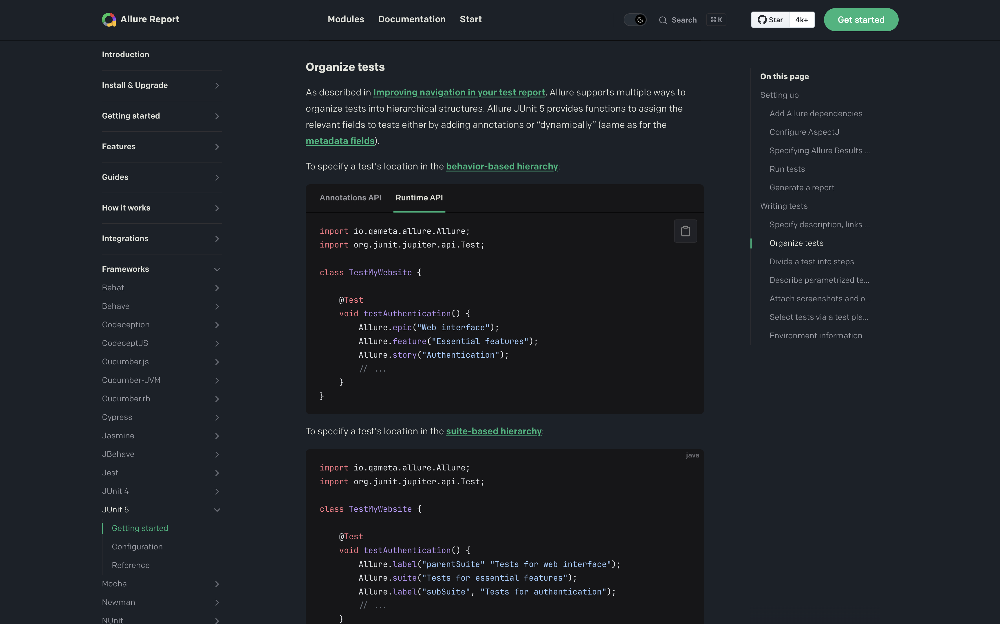

---

## __[https://allurereport.org/docs/junit5/#organize-tests](https://allurereport.org/docs/junit5/#organize-tests)__

# _Behavior_: Epic / Feature / Story


---

## __[https://allurereport.org/docs/junit5/#organize-tests](https://allurereport.org/docs/junit5/#organize-tests)__

# Behavior: Epic / Feature / Story

# _Runtime_ API


---

## __[https://allurereport.org/docs/junit5/#organize-tests](https://allurereport.org/docs/junit5/#organize-tests)__

# Behavior: Epic / Feature / Story

# Runtime API

```groovy
        Allure.epic("Web interface");
        Allure.feature("Essential features");
        Allure.story("Authentication");
```


---


---

# __[https://allurereport.org/docs/gettingstarted-navigation/#behavior-based-hierarchy](https://allurereport.org/docs/gettingstarted-navigation/#behavior-based-hierarchy)__

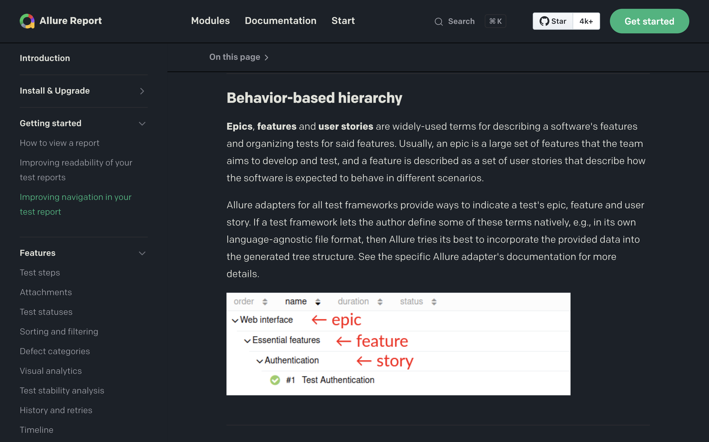


---

# Поля по умолчанию

### __[https://docs.qameta.io/allure-testops/briefly/test-cases/labels/](https://docs.qameta.io/allure-testops/briefly/test-cases/labels/#list-of-standard-labels-used-in-allure-framework)__

* parentSuite, suite, subSuite

* testClass, testMethod
* _epic_, _feature_, _story_
* owner, lead
* thread
* layer
* host

---

# Поля по умолчанию

### __[https://docs.qameta.io/allure-testops/briefly/test-cases/labels/](https://docs.qameta.io/allure-testops/briefly/test-cases/labels/#list-of-standard-labels-used-in-allure-framework)__

- parentSuite, suite, subSuite

- testClass, testMethod
- epic, feature, story
- owner, lead
- thread
- layer
- host

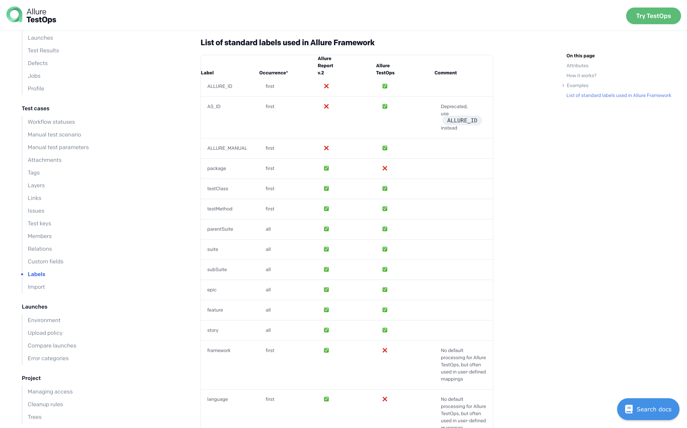


---

# Задать можно _любые_ метки (__label__)


---

# Задать можно _service_ (сервис)

```groovy
⭐️ Allure.label("service",  "API");
```


---

# _endpoint_ (метод сервиса)

```groovy
   Allure.label("service",  "API");
⭐️ Allure.label("endpoint", "GET /projects");
```


---

# _payload_ (параметры метода сервиса)

```groovy
   Allure.label("service",  "API");
   Allure.label("endpoint", "GET /projects");
⭐️ Allure.label("payload",  "fields=item");
```


---

# _dataset_ (тестовые данные)

```groovy
   Allure.label("service",  "API");
   Allure.label("endpoint", "GET /projects");
   Allure.label("payload",  "fields=item");
⭐️ Allure.label("dataset",  "enterprise 10000 users");
```


---

# _version_ (версию сервиса)

```groovy
   Allure.label("service",  "API");
   Allure.label("endpoint", "GET /projects");
   Allure.label("payload",  "fields=item");
   Allure.label("dataset",  "enterprise 10000 users");
⭐️ Allure.label("version",  getServerVersion());
```


---

# _environment_ (тестируемое окружение)

```groovy
   Allure.label("service",  "API");
   Allure.label("endpoint", "GET /projects");
   Allure.label("payload",  "fields=item");
   Allure.label("dataset",  "enterprise 10000 users");
   Allure.label("version",  getServerVersion());
⭐️ Allure.label("environment",     "production");
```


---

# _server-location_ (параметры окружения)

```groovy
   Allure.label("service",  "API");
   Allure.label("endpoint", "GET /projects");
   Allure.label("payload",  "fields=item");
   Allure.label("dataset",  "enterprise 10000 users");
   Allure.label("version",  getServerVersion());
   Allure.label("environment",     "production");
⭐️ Allure.label("server-location", "USA");
```

---

# _client-location_ (параметры клиента)

```groovy
   Allure.label("service",  "API");
   Allure.label("endpoint", "GET /projects");
   Allure.label("payload",  "fields=item");
   Allure.label("dataset",  "enterprise 10000 users");
   Allure.label("version",  getServerVersion());
   Allure.label("environment",     "production");
   Allure.label("server-location", "USA");
⭐️ Allure.label("client-location", "Europe");
```

---

# Задать можно _любые_ метки (__label__)

```groovy
   Allure.label("service",  "API");
   Allure.label("endpoint", "GET /projects");
   Allure.label("payload",  "fields=item");
   Allure.label("dataset",  "enterprise 10000 users");
   Allure.label("version",  getServerVersion());
   Allure.label("environment",     "production");
   Allure.label("server-location", "USA");
   Allure.label("client-location", "Europe");
⭐️ ...
```


---

# Значения могут быть _константами_

# в __Annotation__ API

```groovy
   @Endpoint("GET /projects");
```

---

# Значения могут быть _константами_
# в __Runtime__ API

```groovy
   Allure.label("endpoint", "GET /projects");
```

---

# Значения могут быть _функциями_
# в __Runtime__ API

```groovy
   Allure.label("version",  getServerVersion());
```


---

# Как построить аналитический отчет?


| API          | Payload             | Version 1.2.3 | Version _1.2.4_ |
|:-------------|:--------------------|--------------:|----------------:|
| GET /project | ?fields=id          |           ✅15 |             ✅15 |
| GET /project | ?fields=name        |           ✅15 |             ✅15 |
| GET /project | ?fields=__items__   |           ✅15 |          ✅7 🛑8 |
| GET /project | ?fields=permissions |           ✅15 |             ✅15 |


---

# Как построить аналитический отчет?

## __API__ Export Launch _POST /api/rs/export/testresult/csv_

---

# Как построить аналитический отчет?

## __API__ Export Launch _POST /api/rs/export/testresult/csv_

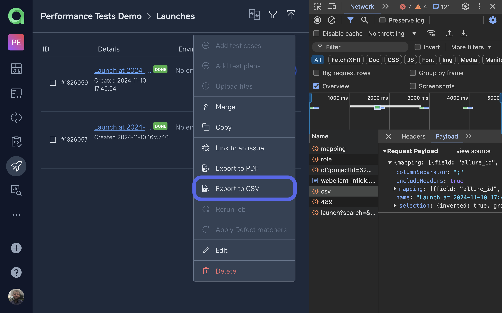

---


---

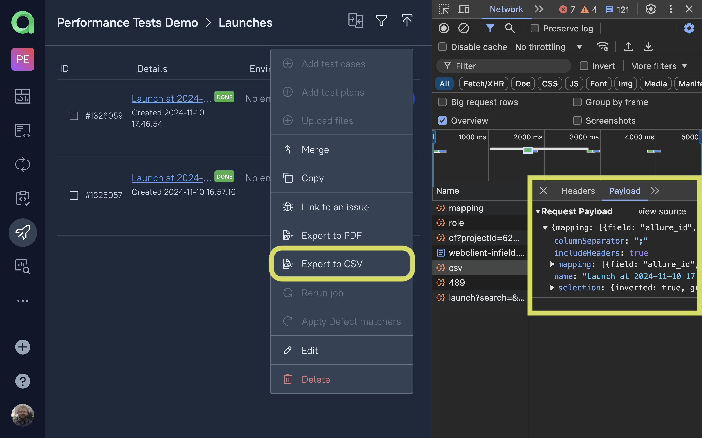


---

# Как построить аналитический отчет?

## __API__ Export Launch _POST /api/rs/export/testresult/csv_


---

# Как построить аналитический отчет?

## API Export Launch POST /api/rs/export/testresult/csv
## _CSV_ загружается в __InfluxDB__ / VictoriaMetrics / ...

---

# Как построить аналитический отчет?

## API Export Launch POST /api/rs/export/testresult/csv
## CSV загружается в InfluxDB / VictoriaMetrics / ...
## __Grafana__ строит _аналитический_ отчет

---

# Как построить аналитический отчет?

## API Export Launch POST /api/rs/export/testresult/csv
## CSV загружается в InfluxDB / VictoriaMetrics / ...
## Grafana строит аналитический отчет
## __Grafana__ показывает _детали_

---

# Как построить аналитический отчет?

## __API__ Export Launch _POST /api/rs/export/testresult/csv_
## _CSV_ загружается в __InfluxDB__ / VictoriaMetrics / ...
## __Grafana__ строит _аналитический_ отчет
## __Grafana__ показывает _детали_


---

# Анализ обычного отчета: _от 2-х часов_


---

# Анализ обычного отчета: _от 2-х часов_

# Анализ аналитики: _от 10-минут_


---

# Анализ обычного отчета: от 2-х часов

# Анализ аналитики: от 10-минут

# Аналитика __выгодна__ уже с _12-го теста_

---

<!-- _class: main -->

# _Allure TestOps_ и _Grafana_ дают читателю __скорость__ анализа

---

# А также ...

---

# А также ...

# легко привязать _дефект_ или _задачу_ к результату теста производительности


---

# А также ...

# легко привязать _дефект_ или _задачу_ к результату теста производительности

---

# А также ...

# легко привязать _дефект_ или _задачу_ к результату теста производительности

# и сделать __mute__ такому тесту

---

<!-- _class: main -->

# Читатели _не игнорируют_ тесты производительности

---

<!-- _class: main -->

# Читатели _~~не~~_ __игнорируют__ тесты производительности __более осознанно__, используя беклог задач


---

<!-- _class: lead -->

# Allure TestOps дает  _привычный_ __интерфейс__  работы с тестами и __API__ для формирования _аналитики_


---

<!-- _class: lead -->

# 5️⃣ Что дает __JUnit__ писателю?

---

# Есть _интеграция_ между __Allure__ и __JUnit__

---

# В __JUnit__ понятная _структура_ проекта

---

# В JUnit понятная структура проекта
### __@BeforeAll__ для подачи нагрузки и _получения метрик_
- Запуск k6/gatling/jmeter/...
- Ожидание метрик от инструмента нагрузки

---

# В JUnit понятная структура проекта
### @BeforeAll для подачи нагрузки и получения метрик
- Запуск k6/gatling/jmeter/...
- Ожидание метрик от инструмента нагрузки
### __@Test__, __@ParameterizedTest__, __@RepeatedTest__ для _проверок_
- Проверка успешности теста и кодов ответов
- Проверка длительности ответов


---

# В __JUnit__ понятная _структура_ проекта
### __@BeforeAll__ для подачи нагрузки и _получения метрик_
- Запуск k6/gatling/jmeter/...
- Ожидание метрик от инструмента нагрузки
### __@Test__, __@ParameterizedTest__, __@RepeatedTest__ для _проверок_
- Проверка успешности теста и кодов ответов
- Проверка длительности ответов

---

# __JUnit__ написан на _Java_

---

# __JUnit__ написан на _Java_

_Популярные_ инструменты нагрузки запускаются из JVM
* __JMeter-Java-DSL__

* __Gatling__


---

# __JUnit__ написан на _Java_

_Любые_ другие инструменты нагрузки тоже запустятся

* В _Java_ есть __[https://java.testcontainers.org/](https://java.testcontainers.org/)__

* Через __TestContainers__ можно запустить _Docker_-контейнеры
* Внутри _Docker_ можно запустить 
  * и __Taurus__ (Python)
  * и __k6__ (Go)
  * и _любой_ другой инструмент подачи нагрузки

---

# __JUnit__ может запустить

- JMeter-Java-DSL

- Gatling
- Taurus
- k6
- _любой инструмент_

---


<!-- _class: main -->

# __JUnit__ интегрирован в _IDE_

---


<!-- _class: main -->

# __JUnit__ интегрирован в _CI_

---

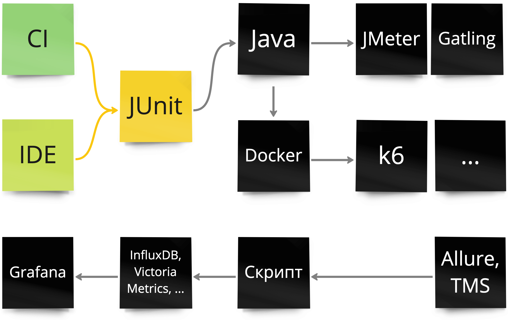

---

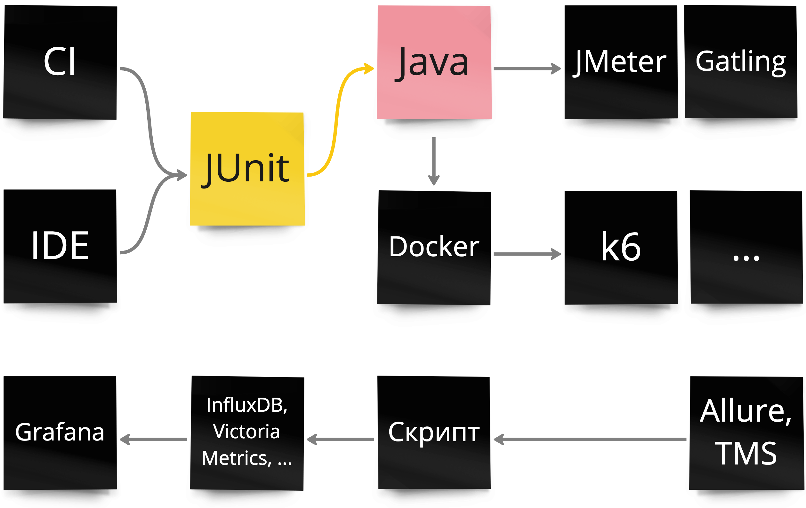

---


---

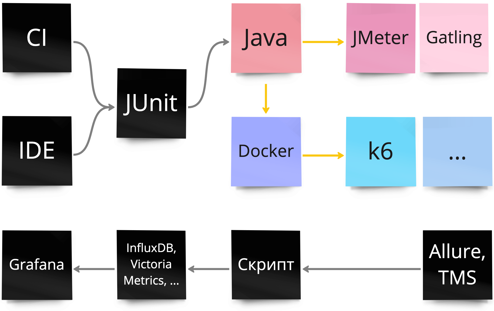

---

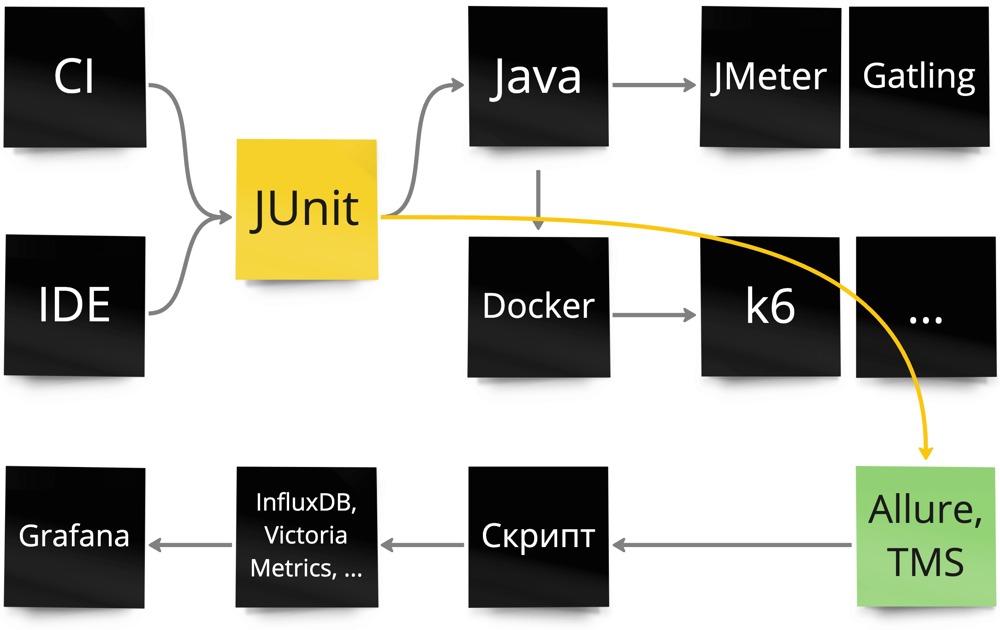

---

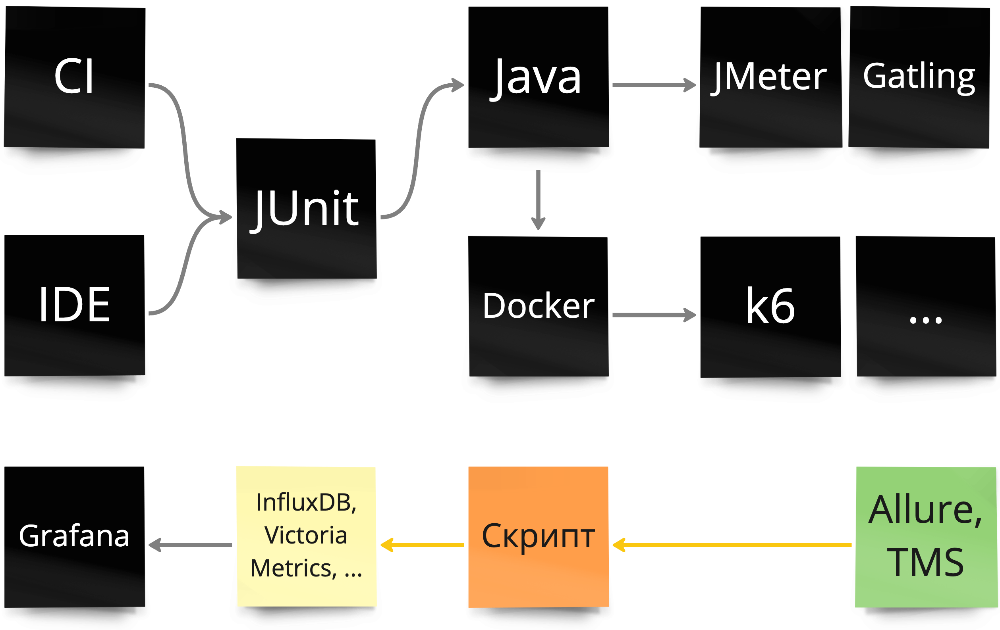

---

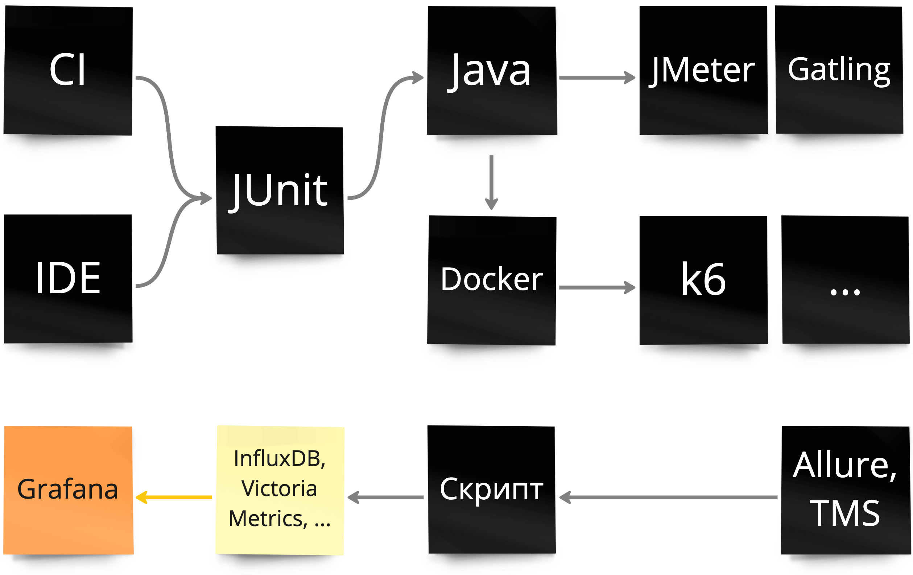

---

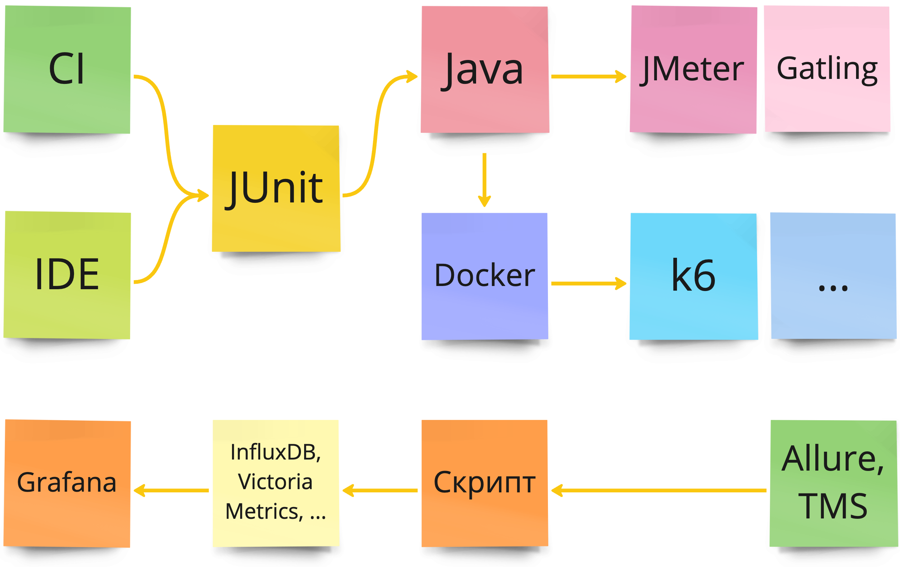

---

# __Фреймворк__ задает структуру проекта

---

# __JUnit__ задает структуру проекта

---

# JUnit задает структуру проекта

# _Статистика_ проверяется __Assertion__-ами

---

# JUnit задает структуру проекта

# k6 _summary.json_ тестируется

---

# JUnit задает структуру проекта

# k6 summary.json тестируется

# __Скрипт__ шлет _результаты_ в __хранилище__

---

# JUnit задает структуру проекта

# k6 summary.json тестируется

# __Скрипт__ шлет _результаты_ в __InfluxDB__

---

# JUnit задает структуру проекта

# k6 summary.json тестируется

# Скрипт шлет результаты в InfluxDB

# __Dashboard__-ы Grafana строят _отчет_

---

# __JUnit__ задает структуру проекта

# k6 _summary.json_ тестируется

# __Скрипт__ шлет _результаты_ в __InfluxDB__

# __Dashboard__-ы Grafana строят _отчет_

---

<!-- _class: lead -->

# 6️⃣ Почему _больше_ тестов — лучше?

---

<!-- _class: main -->

# Много маленьких тестов __увеличивают__ тестовое _покрытие_

---

<!-- _class: main -->

# Много маленьких тестов __стандартизируют__ подачу нагрузки

---

<!-- _class: main -->

# Много маленьких тестов __стандартизируют__ подачу нагрузки, можно _генерировать_ тесты

---

<!-- _class: main -->

# Можно передавать _параметры_ с payload, dataset, environment в шаблонный тест

---

<!-- _class: main -->

# Можно передавать _параметры_ с __payload__, __dataset__, __environment__ в шаблонный тест

---

<!-- _class: main -->

# Можно передавать _параметры_ с __payload__, __dataset__, __environment__ в _шаблонный_ тест

---

<!-- _class: main -->

# __AI__ _сгенерирует_ код из комбинации параметров и шаблона

---

<!-- _class: main -->

# AI _сгенерирует_ код из комбинации параметров и шаблона

---

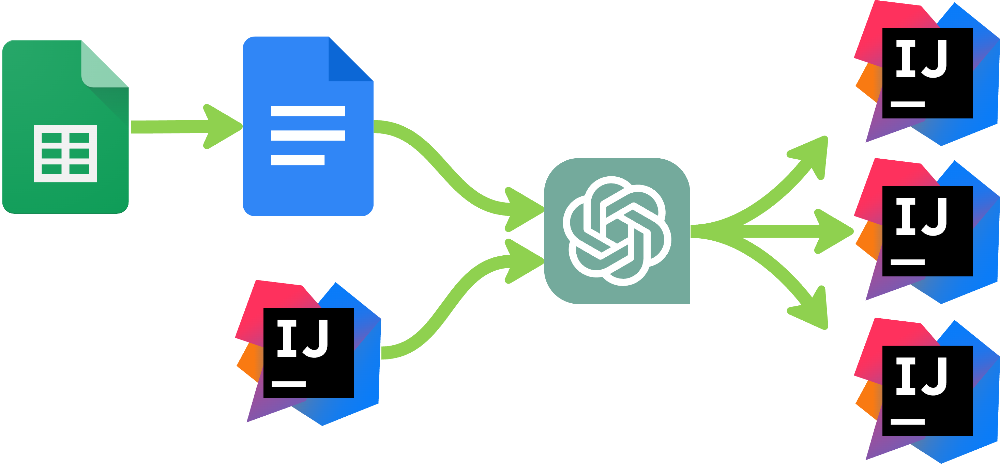

---

<!-- _class: lead -->

# 7️⃣ Какие есть __примеры__?


---

<!-- _class: main -->

# Demo

---

<!-- _class: main -->

# Сотня простых тестов 
# _долго_ выполняется, 
# да _быстро_ анализируется

---

# Понравилось? _=>_
### [@qa_load](https://t.me/qa_load)
### [@smirnovqa](https://t.me/smirnovqa)
### [github.com/polarnik/k6-junit-integration](https://github.com/polarnik/k6-junit-integration)
### [polarnik.github.io/k6-junit-integration/codetalks](https://polarnik.github.io/k6-junit-integration/codetalks/)


<script src="https://cdnjs.cloudflare.com/ajax/libs/highlight.js/11.9.0/highlight.min.js"></script>
<script src="https://cdnjs.cloudflare.com/ajax/libs/highlight.js/11.9.0/languages/java.min.js"></script>
<script>
document.querySelectorAll('code').forEach(el => {
  // then highlight each
  hljs.highlightElement(el);
});
</script>
